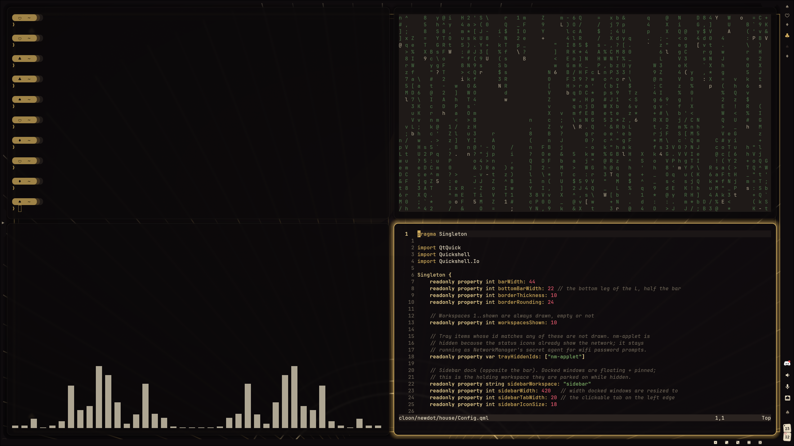
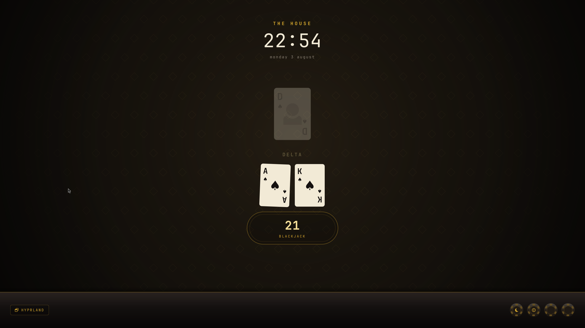

# ♠ the house

My Linux ricing setup, casino edition — Arch + Hyprland. Black lacquer,
champagne gold, green felt and neon marquee. The house always wins.

<!-- Drop a hero screenshot here once you have one -->


## The rice

| | |
|---|---|
| **Distro** | Arch Linux |
| **WM** | [Hyprland](https://hyprland.org) |
| **Shell (bar/dock/notifications)** | quickshell — [`house`](house/README.md) |
| **Terminal** | kitty |
| **Launcher** | rofi |
| **Notifications** | quickshell `house` (replaces dunst) |
| **Wallpaper** | awww |
| **GTK / Qt theming** | GTK 3/4 + Kvantum |
| **Font** | JetBrainsMono Nerd Font |

## The tables

One shell, four palettes — switch live with `Super+T` (the `♠` button in the
bar). The picker previews as you arrow through; the choice retints the bar, the
notifications, kitty-adjacent chrome and Hyprland's window borders together.

| Table | The room | surface / accent / urgent |
|---|---|---|
| **♠ Noir** *(default)* | The high-roller room — black lacquer, champagne gold, deep crimson | `#0e0b0d` `#d4af5f` `#c13a4e` |
| **♣ Felt** | The poker table — green baize, brass rail, ivory chips | `#0e2b1c` `#c9a227` `#c0392f` |
| **♦ Vegas** | The strip at midnight — neon pink marquee, cyan bulbs, gold glow | `#0a0a14` `#ff2e88` `#ff6247` |
| **♥ Daylight Robbery** | The one light table — cream carpet, old gold, card red | `#f5efe2` `#9c7a1e` `#b3372f` |

Workspaces in the bar are dealt as suits (`♠ ♥ ♦ ♣ ★`); the active one lights
up in the table's accent.

## The door

The SDDM greeter — [`door`](door/README.md). Logging in is a hand of blackjack:
every character you type drops a clay chip onto a stack standing in the betting
circle (there is no row of asterisks anywhere in it), enter pushes the bet into
the pot and deals. Right password, the cards turn over ace and king. Wrong, they
turn over seventeen, the house hits you, you bust, and the table sweeps itself.



Gold on black, and deliberately *not* wired to the tables above — the greeter
runs as the `sddm` user with no access to anyone's `~/.config`, and a login
screen that followed a per-user preference would be announcing who last sat down
before anyone has authenticated. It has its own palette and it does not change.

## Install

```bash
# 1. clone
git clone git@github.com:Dhev-1/the-house.git ~/cloon/newdot
cd ~/cloon/newdot

# 2. install packages
sudo pacman -S --needed - < packages.txt
#    AUR packages (with an AUR helper, e.g. yay):
yay -S --needed - < packages-aur.txt

# 3. symlink the configs
./install.sh

# 4. optional - take over the login screen
cd door && ./install.sh
```

`install.sh` uses GNU Stow (`sudo pacman -S stow`) to symlink each package in
`home/` into `$HOME`. Run `./install.sh hypr kitty` to stow only some.

`door/install.sh` is separate and takes sudo: the greeter theme goes to
`/usr/share/sddm/themes/door` and the active theme is set through a drop-in at
`/etc/sddm.conf.d/10-theme.conf`. Delete that file to go back to whatever you
were using. `./install.sh --copy` installs it without switching.

## Post-install

- **Repo location matters:** the hypr config launches and talks to the shell by
  absolute path — `qs -p ~/cloon/newdot/house` (autostart in `hyprland.conf`,
  plus the notification / theme / dock keybinds). Clone this repo to
  `~/cloon/newdot`, or find-and-replace that path across
  `home/hypr/.config/hypr/*.conf` to match where you put it.
- Wallpapers per table live in `wallpapers/` — set one with
  `awww img wallpapers/noir.png` (or `felt` / `vegas` / `daylight`) — though the
  table picker (`Super+T`) sets it for you.

## Layout

```
newdot/
├── house/           # quickshell config (bar/dock/notifications/table picker)
├── door/            # SDDM greeter (installs system-wide, own install.sh)
├── home/            # GNU Stow packages, mirror $HOME
│   ├── hypr/  kitty/  rofi/  btop/  gtk/  kvantum/  starship/  icons/
├── wallpapers/      # generated casino wallpapers, one per table
├── assets/screenshots/
├── packages.txt        # native (pacman -Qqen)
├── packages-aur.txt    # AUR   (pacman -Qqem)
└── install.sh
```

## Keybinds

`$mainMod` = SUPER. Full list in `home/hypr/.config/hypr/binds.conf`.

| Keys | Action |
|---|---|
| `SUPER` + `SPACE` | terminal (kitty) |
| `SUPER` + `T` | table picker (themes) |
| `SUPER` + `E` | file manager (thunar) |
| `SUPER` + `O` | firefox |
| `SUPER` + `B` | brave |
| `SUPER` + `J` / `K` | cycle windows |
| `SUPER` + `G` | toggle group |
| `SUPER` + `SHIFT` + `H/J/K/L` | move into group |
| `ALT` + `Tab` | cycle + raise |
| `SUPER` + `SHIFT` + `N` | dismiss all notifications |
