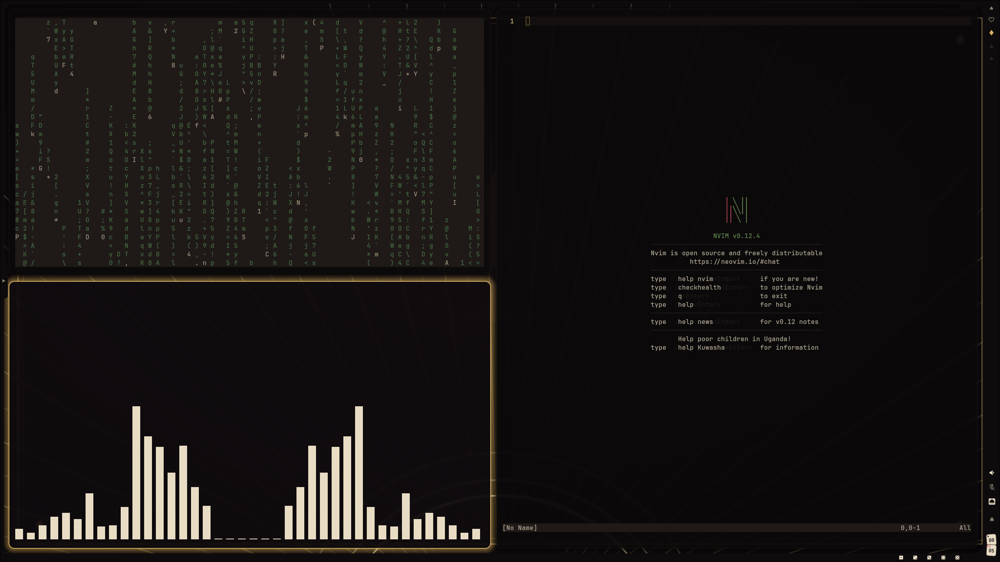
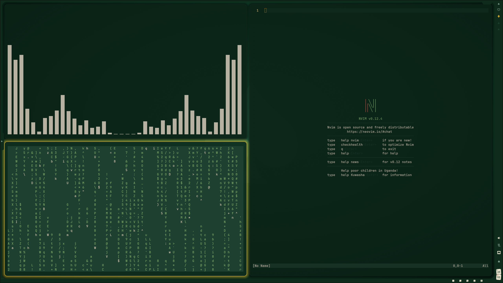
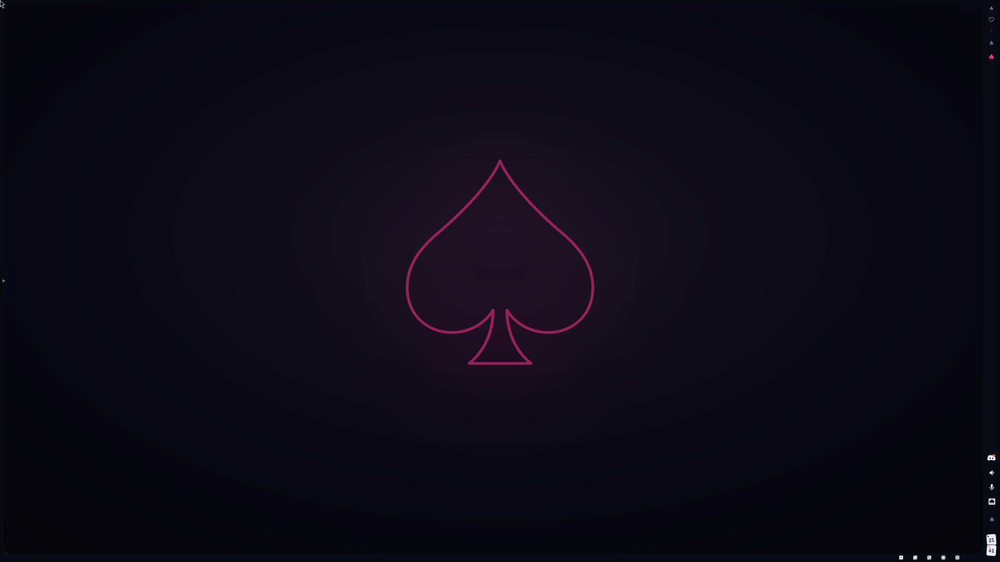
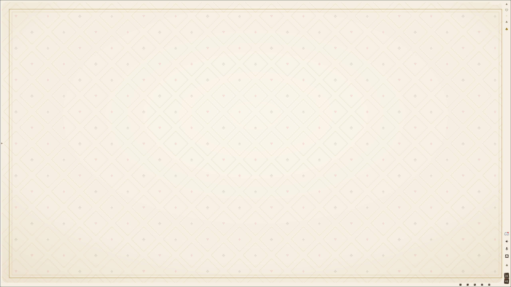
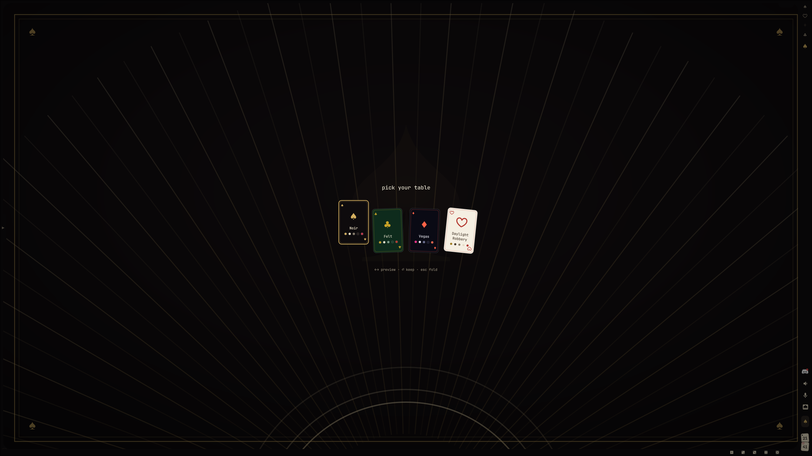
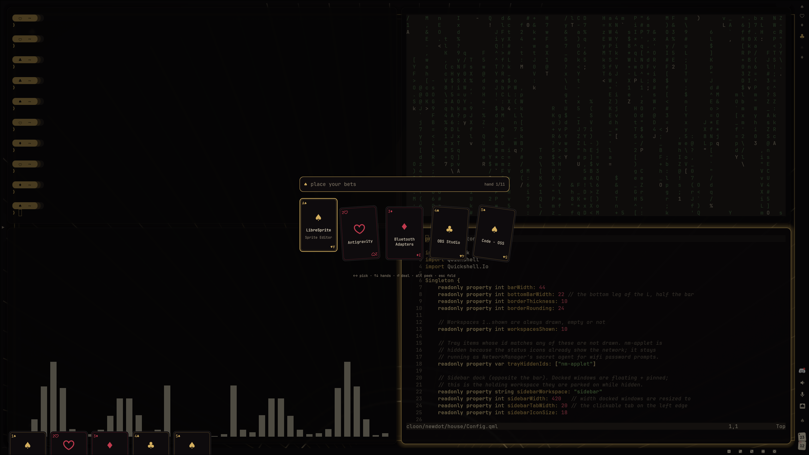

# ♠ the house

My Linux ricing setup, casino edition — Arch + Hyprland. Black lacquer,
champagne gold, green felt and neon marquee. The house always wins.


## The rice

| | |
|---|---|
| **Distro** | Arch Linux |
| **WM** | [Hyprland](https://hyprland.org) |
| **Shell (bar/dock/notifications)** | quickshell — [`house`](house/README.md), replacing dunst |
| **Terminal** | kitty |
| **Launcher** | quickshell `house` — a hand of apps, `Super+D` (rofi kept for its other modes) |
| **Wallpaper** | awww |
| **GTK / Qt theming** | GTK 3/4, and qt6ct + Kvantum for Qt — both retinted per table |
| **Font** | JetBrainsMono Nerd Font |

## The tables

One shell, four palettes — switch live with `Super+T` (the `♠` button in the
bar). The picker previews as you arrow through; the choice retints the bar, the
notifications, kitty-adjacent chrome and Hyprland's window borders together.

| Table | The room | surface / accent / urgent |
|---|---|---|
| **♠ Noir** *(default)* | The high-roller room — black lacquer, champagne gold, deep crimson | `#0e0b0d` `#d4af5f` `#c13a4e` |
| **♣ Felt** | The poker table — green baize, brass rail, ivory chips | `#0e2b1c` `#c9a227` `#c0392f` |
| **♦ Vegas** | The strip at midnight — neon pink marquee, cyan bulbs, gold glow | `#0a0a14` `#ff2e88` `#ff6247` |
| **♥ Daylight Robbery** | The one light table — cream carpet, old gold, card red | `#f5efe2` `#9c7a1e` `#b3372f` |

Workspaces in the bar are dealt as suits (`♠ ♥ ♦ ♣ ★`); the active one lights
up in the table's accent.

| | |
|---|---|
|  |  |
| **♠ Noir** | **♣ Felt** |
|  |  |
| **♦ Vegas** | **♥ Daylight Robbery** |

`Super+T` deals the picker — arrow through to preview the room, enter to keep it,
esc to fold.



## The launcher

`Super+D` deals a hand of apps. Type to filter, arrow to pick, enter to deal —
the desk dims behind it and the cards keep the table's palette.



## The door

The SDDM greeter — [`door`](door/README.md). Logging in is a hand of blackjack:
every character you type drops a clay chip onto a stack standing in the betting
circle (there is no row of asterisks anywhere in it), enter pushes the bet into
the pot and deals. Right password, the cards turn over ace and king. Wrong, they
turn over seventeen, the house hits you, you bust, and the table sweeps itself.


Gold on black, and deliberately *not* wired to the tables above — the greeter
runs as the `sddm` user with no access to anyone's `~/.config`, and a login
screen that followed a per-user preference would be announcing who last sat down
before anyone has authenticated. It has its own palette and it does not change.

## Install

```bash
# 1. clone
git clone --recurse-submodules https://github.com/Dhev-1/the-house.git ~/cloon/newdot
cd ~/cloon/newdot

# 2. install what the rice needs
sudo pacman -S --needed - < packages-required.txt
#    quickshell and awww may need an AUR helper depending on your repos:
yay -S --needed quickshell awww

# 3. put the configs in place
./install.sh          # copies (default) - the repo and ~/.config stay independent
./install.sh --stow   # or symlink, so ~/.config points into this repo

# 4. optional - take over the login screen
cd door && ./install.sh
```

`install.sh` copies each package in `home/` into `$HOME` by default. `--stow`
symlinks them instead, using GNU Stow (`sudo pacman -S stow`) — edits then land
straight in the tree, and the repo has to stay where it is. `--unstow` removes
the symlinks again. Add package names to limit it: `./install.sh --stow hypr
kitty`. Anything a mode would overwrite is backed up under `~/.dotfiles-backup`
first.

`door/install.sh` is separate and takes sudo: the greeter theme goes to
`/usr/share/sddm/themes/door` and the active theme is set through a drop-in at
`/etc/sddm.conf.d/10-theme.conf`. `./install.sh --copy` installs it without
switching.

**Try it before you switch.** A greeter that fails to start means no graphical
login, so preview it first:

```bash
sddm-greeter-qt6 --test-mode --theme /usr/share/sddm/themes/door
```

If you are already locked out, the greeter is one file: switch to a TTY with
`Ctrl+Alt+F2`, log in, and

```bash
sudo rm /etc/sddm.conf.d/10-theme.conf && sudo systemctl restart sddm
```

puts the stock greeter back.

## Post-install

- **Repo location matters:** the hypr config launches and talks to the shell by
  absolute path — `qs -p ~/cloon/newdot/house` (autostart in `hyprland.conf`,
  plus the notification / theme / dock keybinds). Clone this repo to
  `~/cloon/newdot`, or find-and-replace that path across
  `home/hypr/.config/hypr/*.conf` to match where you put it.
- Wallpapers per table live in `wallpapers/` — set one with
  `awww img wallpapers/noir.png` (or `felt` / `vegas` / `daylight`) — though the
  table picker (`Super+T`) sets it for you.

## Layout

```
newdot/
├── house/           # quickshell config (bar/dock/notifications/table picker)
├── door/            # SDDM greeter (installs system-wide, own install.sh)
├── home/            # GNU Stow packages, mirror $HOME
│   ├── hypr/  kitty/  rofi/  btop/  gtk/  kvantum/  starship/  icons/
├── games/           # the widgets: blackjack, roulette, video poker, bones, ride the bus
├── wallpapers/      # generated casino wallpapers, one per table
├── assets/screenshots/
├── packages-required.txt  # what the rice needs
└── install.sh
```

## Keybinds

`$mainMod` = SUPER. Full list in `home/hypr/.config/hypr/binds.conf`.

| Keys | Action |
|---|---|
| `SUPER` + `SPACE` | terminal (kitty) |
| `SUPER` + `D` | launcher (a hand of apps) |
| `SUPER` + `T` | table picker (themes) |
| `SUPER` + `E` | file manager (thunar) |
| `SUPER` + `B` | brave |
| `SUPER` + `J` / `K` | cycle windows |
| `SUPER` + `G` | toggle group |
| `SUPER` + `SHIFT` + `H/J/K/L` | move into group |
| `ALT` + `Tab` | cycle + raise |
| `SUPER` + `SHIFT` + `N` | dismiss all notifications |

## The fine print

[MIT](LICENSE) — take what you like, the house doesn't mind.

The chips, cards and wallpapers are generated by the scripts in this repo
(`door/make-chips.py`, the `wallpapers/*.svg` sources). JetBrainsMono Nerd Font
is not bundled — it comes in with `packages-required.txt`.

